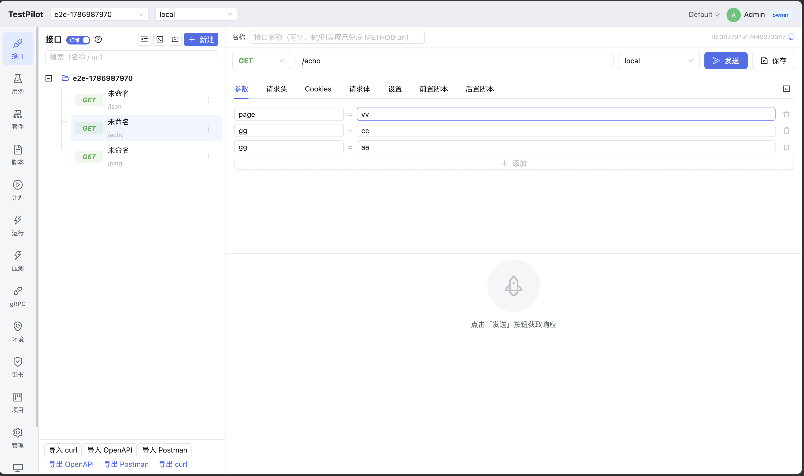
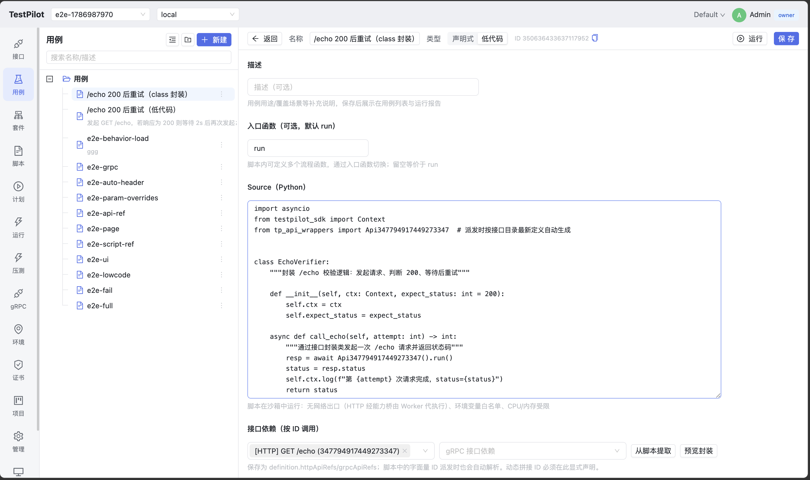

# TestPilot

> For the Chinese version, see [README.zh-CN.md](README.zh-CN.md).

> ⚠️ **This project is under active development and testing. APIs and behavior may change at any time, and bugs are possible.**
> Trials and feedback are welcome; for production use, evaluate carefully and pin versions.

TestPilot is an LLM-enhanced integration testing platform: manage HTTP / gRPC APIs in one place, write tests as declarative step trees or Python low-code, run Playwright browser E2E and distributed stress tests, and generate/analyze tests with an AI Copilot — with multi-tenancy, RBAC, scheduled runs, notifications, and CI integration built in for teams.

## Features

### Screenshots




### API management

- HTTP APIs: method / URI / params / headers / cookies / body / TLS / redirects / JSONC / binary references;
  per-API debug workspace with instant request & response panels.
- Design/debug separation: presets for parameter types, required flags, defaults, and descriptions,
  plus JSON Schema for request/response bodies; debug mode can prefill from the design and toggle
  which params/headers/cookies are sent.
- gRPC APIs: proto file assets + server reflection for dynamic invocation, no pre-compiled stubs.
- Folder trees, projects / environments / variables / certificates; variables support `{{expr}}`
  templates and sensitivity markers. Data models ("Structures") define reusable JSON Schemas.
- Import/export: OpenAPI 3, curl commands, Postman Collection v2.1;
  Copilot can apply incremental OpenAPI diffs (`apply_openapi_diff`).

### Testing

- **Declarative cases**: recursive step trees with API_CALL / GRPC_CALL / ASSERTION / SET_VAR /
  IF / LOOP / RETRY / DELAY / CODE_BLOCK / UI_ACTION, pre/post scripts, and per-step parameter overrides.
- **Low-code cases**: `testpilot-sdk` Python SDK + `assert_that` chained assertions; call APIs by ID
  (`ctx.http_api(id)` / `ctx.grpc_api(id)`); `Api<ID>` wrapper classes are generated at dispatch time.
  Scripts run in a restricted sandbox — HTTP/variable/UI side effects are executed by the Worker via a
  capability bridge, so the sandbox holds zero credentials.
- **Playwright E2E**: the `ctx.page` page model with 13 UI actions; screenshot / trace / HAR artifacts;
  traces replay in Playwright Trace Viewer.
- **Suites / plans / script assets**: ordered suite expansion, script asset reuse (`script_ref`),
  plan item parameter overrides, and single-case runs.

### Reporting & CI

- Three-level result model: TestRun → TestCaseResult → TestStepResult, with request/response snapshots,
  assertion details, and artifacts.
- **Real-time progress**: SSE channels (run/project/stress/workers) replace high-frequency polling;
  run lists, detail drawers, stress reports, and worker status refresh live, with a 30s reconciliation fallback.
- **JUnit XML export** for run lists and run details (`GET /runs/:id/junit`).
- The `run_finished` webhook carries `junit_url` for event-driven CI (Jenkins / GitLab etc.).
- **API tokens**: issue/revoke `tp_` machine credentials from the admin console for CI / CLI;
  only hashes are stored, and permissions follow the issuer's tenant role.
- Run cancellation, tenant quotas, data retention policies, and artifact lifecycle management.

### Stress testing

- API stress: Locust subprocess load generation, load split across workers, RPS / P95 / error-rate time series.
- Behavior stress: low-code cases as load models, executed in a long-lived sandbox loop, gated by
  concurrency and ramp profiles.

### Copilot

- Generate APIs / cases / plans from natural language, analyze failure root causes, and answer
  coverage & directory questions.
- **Playwright UI case generation**: `create_ui_test_case` turns natural-language flows into structured
  UI steps — visual UI_ACTION step trees by default, low-code `ctx.page` scripts for complex flows.
- Write/trigger actions default to HITL approval and are audited; the current page project/environment
  context is honored.
- Supports DeepSeek and any OpenAI-compatible endpoint; the frontend streams via Vercel AI SSE.
- **Reply language** follows the UI language (sent per request via the `X-TP-Lang` header);
  `TP_COPILOT_DEFAULT_LANGUAGE` sets the default (`zh`).

### Platform

- Multi-tenant isolation, snowflake IDs, JWT + OIDC / OAuth2 login, owner / admin / member / viewer RBAC.
- Scheduled runs, Webhook / DingTalk / Feishu notifications, quotas, tenant settings, audit logs.
- Versioned schema migrations (`schema_migrations`), SQLite / PostgreSQL storage,
  S3-compatible artifact backends, Prometheus metrics + OpenTelemetry tracing.
- Docker Compose production deployment template (Scheduler / Worker / Copilot / PG / Jaeger / Prometheus).

### Internationalization

- The web console supports **English and Chinese**; switch via the globe icon in the top-right corner
  (also available on the login page). The choice persists in `localStorage` (`tp_lang`).
- Backend components (scheduler / worker / copilot tool surface) return **English-only, standardized
  messages** with stable error codes (see `docs/error-codes.md`); all display-side localization happens
  in the frontend. `GET /api/v1/meta/locale` reports the backend message language (`en-US`).

## Components

| Component | Stack | Address | Role |
|---|---|---|---|
| Scheduler | Go · fiber v3 · GORM · gRPC | `:8080` REST/frontend, `:9090` gRPC | Domain CRUD, auth/RBAC, scheduling, result persistence, notifications, Copilot tool surface |
| Worker | Python · asyncio · httpx · grpcio | connects to `:9090` | Declarative engine, low-code sandbox, Playwright, stress testing |
| Copilot | Python · FastAPI · pydantic-ai | `:8100` | AI agent: reads/writes via Scheduler gRPC tools, HITL approval |
| Frontend | React · TypeScript · Vite · Ant Design | `:5173` (dev) | IDE-style console: APIs, cases, plans, reports, admin, Copilot chat |
| echo | Python stdlib | `:18080` | Local echo service for development |

## Quick start

Prerequisites: Go 1.25+, Python 3.13, Node 22+ and pnpm 11+.

```bash
# 1. Worker dependencies (Playwright optional)
cd worker && uv sync --extra playwright \
  && venv/bin/python -m playwright install chromium && cd ..

# 2. Copilot dependencies + LLM key
cd copilot && uv sync && cp .env.example .env && cd ..
# Edit copilot/.env and set TP_COPILOT_API_KEY

# 3. Frontend dependencies
cd web && pnpm install && pnpm build && cd ..

# 4. Start the full stack (scheduler + worker + copilot + echo + vite)
scripts/dev.sh start

# 5. End-to-end verification
worker/venv/bin/python scripts/e2e.py
```

Open <http://localhost:5173> (dev hot reload) or <http://localhost:8080> (Scheduler serving the built frontend).
Default account: `admin / admin123` (in production you must change `TP_ADMIN_PASSWORD` and `TP_JWT_SECRET`).

Stop: `scripts/dev.sh stop`; status: `scripts/dev.sh status`.

## Usage

### CI integration example

```bash
# 1. Create a machine token in the admin console "API Token" tab (shown only once)
TOKEN="tp_..."

# 2. Trigger a plan run
curl -s -X POST http://localhost:8080/api/v1/plans/<plan_id>/run \
  -H "Authorization: Bearer $TOKEN"

# 3. Download the JUnit report when the run finishes
curl -s -o junit.xml http://localhost:8080/api/v1/runs/<run_id>/junit \
  -H "Authorization: Bearer $TOKEN"
```

Alternatively, subscribe a notification channel to `run_finished`; the webhook payload carries
`status` / `summary` / `junit_url`, so CI can fetch reports event-driven without polling.

### Configuration

All three services use one three-level config scheme: CLI flag > environment variable > YAML file.
Per-key annotated templates: `deploy/scheduler.yaml.example` / `deploy/worker.yaml.example` /
`deploy/copilot.yaml.example`. For production environment variables and the security checklist see
`docs/deployment.md`.

### Full documentation

| Document | Contents |
|---|---|
| `docs/design.md` | Architecture and design decisions |
| `docs/data-model.md` | Data model and 33 tables |
| `docs/usage.md` | Manuals for cases, scheduling, notifications, Copilot, stress, CI |
| `docs/api.md` | REST API reference |
| `docs/deployment.md` | Deployment, databases, artifact storage, observability, security checklist |
| `docs/ci-migration-plan.md` | Versioned migrations, JUnit/webhooks, API tokens, proto governance, CI/CD |
| `docs/lowcode-api-invocation.md` | Low-code invocation by API ID and auto-generated wrappers |
| `docs/blog-lowcode-copilot.md` | Tech blog: design advantages of low-code + Copilot vs traditional API tools |
| `docs/roadmap.md` | Phased roadmap, risk register, deferred items |
| `docs/error-codes.md` | Error code registry |

## Development

### Repository layout

```text
scheduler/   Go: domain models, REST/gRPC, scheduling, migrations, notifications, artifacts
worker/      Python: execution engine, low-code SDK, sandbox, Playwright, stress testing
copilot/     Python: FastAPI + pydantic-ai agent and toolset
web/         React: console frontend
proto/       protobuf single contract (common / worker / copilot)
deploy/      Dockerfiles, compose and YAML templates
docs/        design, data model, usage, deployment, API docs
scripts/     dev, e2e, proto generation/check scripts
```

### Tests & build

```bash
# Scheduler
cd scheduler && go test ./...

# Worker
cd worker && venv/bin/python -m pytest -q -W error::pytest.PytestUnraisableExceptionWarning

# Copilot
cd copilot && venv/bin/python -m pytest -q

# Frontend
cd web && pnpm lint && pnpm build
```

### Proto contract governance

- Protos live in `proto/` — the single source of truth for Go / Worker / Copilot.
- Generate: `scripts/proto-gen.sh` (Go gRPC + Worker/Copilot Python gRPC + grounding).
- Check: `scripts/proto-check.sh` (`buf lint` / `buf breaking` + zero-drift regeneration check).
- Generated code is committed to support offline builds; after changing protos, commit the
  regenerated artifacts too.
- Pinned versions: protoc v35, protoc-gen-go v1.28.1, protoc-gen-go-grpc v1.2.0,
  grpcio-tools 1.83.0 / protobuf 7.35.1. Note the plugins must be built with **Go ≥ 1.19**
  (`go install ...@v1.28.1`): gofmt's doc comment rules insert `//` separator lines into
  oneof comment blocks in the artifacts; plugins built with older Go emit the old format and
  fail the zero-drift check with false drift.

### Database migrations

- Migration bookkeeping table `schema_migrations`; `v1` = the current GORM AutoMigrate baseline.
- To add a migration: register the next version in `scheduler/internal/migrate/migrate.go`, provide
  idempotent SQL for both SQLite / PostgreSQL, and add tests covering both existing and fresh databases.
- See `docs/ci-migration-plan.md` for the full conventions.

### CI / CD

- `.github/workflows/ci.yml`: proto governance + Scheduler / Worker / Copilot tests + frontend build.
- `.github/workflows/cd.yml`: triggered by `v*` tags; builds and pushes Scheduler / Worker / Copilot
  images to `ghcr.io`.

## License

TestPilot is licensed under the [Apache License 2.0](LICENSE) (`SPDX: Apache-2.0`):

- **Open-source use**: commercial use, modification, closed-source derivatives, and redistribution are
  allowed, provided copyright and attribution notices are retained (Apache 2.0 §4).
- **Trademark**: use of the TestPilot name and logo is governed by the
  [Trademark Guidelines](TRADEMARK_GUIDELINES.md).
- **Commercial licensing**: for white-labeling (attribution-free) or special warranties, see
  [COMMERCIAL_LICENSE_EN.md](COMMERCIAL_LICENSE_EN.md) (English) and
  [COMMERCIAL_LICENSE.md](COMMERCIAL_LICENSE.md) (Chinese).
