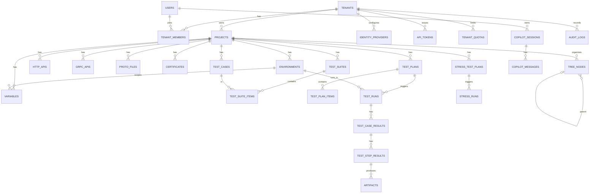

# TestPilot 数据模型（ER 与表结构）

> 📚 文档导航：[设计](design.md) · [数据模型](data-model.md) · [路线图](roadmap.md) · [使用指南](usage.md) · [部署](deployment.md) · [API 参考](api.md) · [错误码](error-codes.md) · [v2 特性](v2-features.md)

## 目录

1. 约定
2. ER 图
3. 租户与访问控制
4. 项目 / 环境 / 变量 / 证书
5. 接口
6. 目录树
7. 测试用例 / 套件 / 计划
8. 运行结果
9. 压力测试
10. Copilot
11. 审计 / 配额
12. 索引与查询要点
13. 备注

---

> 与 `docs/design.md` 第 3/4 章领域模型、第 9 章存储、`proto/testpilot/common/v1/types.proto` 对齐。
> 本文档定义逻辑模型与表结构。落地方式：**运行库 schema 由 Scheduler 启动时 GORM AutoMigrate
> 创建/演进**（`scheduler/internal/model`，当前 29 张——含 v2 已落地的 test_suites /
> test_suite_items / scripts）；`docs/sql/*.sql` 为生产 DDL 参考脚本
> （32 表，含 3 张 v2 预留——grpc_apis / proto_files / api_tokens，尚未进 GORM 模型，随 v2 第三批落地）。

## 0. 约定

- **主键**：所有表 PK 为 `BIGINT`（snowflake，long），与 tenant_id 同策略。proto/JSON 传输时序列化为 `string`（避免 JS 64 位精度丢失）。
- **tenant_id**：所有业务表携带 `BIGINT tenant_id`，并建立联合索引 `(tenant_id, ...)`；应用层强制过滤（无 DB 层 RLS）。
- **JSONB 文档列**：复杂嵌套结构（步骤树、BodySpec、params/headers/settings/scripts、plan items、结果快照）存 `JSONB`，而非过度规范化的子表。可查询/关系性字段（id、project_id、status、name）为独立列；文档内部结构对应 `types.proto` 的 JSON 表示。
- **枚举**：存 `SMALLINT`（对应 proto enum 编号）或 `VARCHAR`，二选一，团队定（建议 SMALLINT + 字典表注释）。
- **软删除**：核心配置类实体（project/api/case/plan）用 `deleted_at` 软删；运行结果类硬删（按 13.5 保留策略清理）。
- **时间戳**：`TIMESTAMPTZ`。
- DB：PostgreSQL 为主（JSONB 依赖 PG；MySQL 用 `JSON`，SQLite 用 `TEXT`）。

---

## 1. ER 图

---

## 2. 租户与访问控制

### tenants
| 列 | 类型 | 说明 |
|----|------|------|
| id | BIGINT PK | snowflake |
| name | VARCHAR | 租户名 |
| status | SMALLINT | active/suspended |
| created_at | TIMESTAMPTZ | |

### users
| 列 | 类型 | 说明 |
|----|------|------|
| id | BIGINT PK | snowflake |
| username | VARCHAR UNIQUE | 登录名 |
| email | VARCHAR | 外部身份映射键 |
| password_hash | VARCHAR NULL | 本地账号；外部用户为空 |
| display_name | VARCHAR | |
| status | SMALLINT | active/disabled |
| created_at | TIMESTAMPTZ | |

### identity_providers（可插拔身份源）
| 列 | 类型 | 说明 |
|----|------|------|
| id | BIGINT PK | |
| tenant_id | BIGINT NULL FK→tenants | 空 = 系统级默认 |
| type | SMALLINT | local/oidc/oauth2 |
| name | VARCHAR | |
| config | JSONB | issuer/client_id/scopes/字段映射等 |
| enabled | BOOLEAN | |

### tenant_members（用户-租户-角色）
| 列 | 类型 | 说明 |
|----|------|------|
| id | BIGINT PK | |
| tenant_id | BIGINT FK | |
| user_id | BIGINT FK | |
| role | SMALLINT | owner/maintainer/tester/viewer/admin |
| created_at | TIMESTAMPTZ | |

UNIQUE `(tenant_id, user_id)`；INDEX `(user_id)`。

### api_tokens（CI/CLI 租户级 token）
| 列 | 类型 | 说明 |
|----|------|------|
| id | BIGINT PK | |
| tenant_id | BIGINT FK | |
| user_id | BIGINT FK | 颁发者 |
| name | VARCHAR | |
| token_hash | VARCHAR | 仅存哈希 |
| scopes | JSONB | 最小权限（如 run:trigger） |
| expires_at | TIMESTAMPTZ NULL | |
| last_used_at | TIMESTAMPTZ NULL | |

---

## 3. 项目 / 环境 / 变量 / 证书

### projects
| 列 | 类型 | 说明 |
|----|------|------|
| id | BIGINT PK | |
| tenant_id | BIGINT FK | INDEX `(tenant_id)` |
| name | VARCHAR | |
| description | TEXT | |
| config | JSONB | 项目级配置（默认超时/并发） |
| created_at / updated_at / deleted_at | TIMESTAMPTZ | 软删 |

### environments
| 列 | 类型 | 说明 |
|----|------|------|
| id | BIGINT PK | |
| tenant_id | BIGINT | INDEX `(tenant_id, project_id)` |
| project_id | BIGINT FK | |
| icon / name / description | VARCHAR/TEXT | |
| base_url | VARCHAR | 前置 URL |

### variables
| 列 | 类型 | 说明 |
|----|------|------|
| id | BIGINT PK | |
| tenant_id | BIGINT | INDEX `(tenant_id, project_id)` |
| project_id | BIGINT FK | |
| environment_id | BIGINT NULL FK | 空 = 项目级 |
| scope | SMALLINT | project/environment |
| category | SMALLINT | header/cookie/query/body/custom |
| key / value | VARCHAR/TEXT | 非敏感明文 |
| sensitive | BOOLEAN | |
| secret_ref | VARCHAR NULL | vault://tenant/{tid}/... 或 tink 引用 |
| description | TEXT | |

UNIQUE `(project_id, environment_id, category, key)`（COALESCE environment_id）。

### certificates
| 列 | 类型 | 说明 |
|----|------|------|
| id | BIGINT PK | |
| tenant_id | BIGINT | INDEX |
| project_id | BIGINT FK | |
| name / description / type | VARCHAR | type: pem/p12 |
| cert_ref / key_ref | VARCHAR | artifact 引用或密文 |
| password_secret_ref | VARCHAR NULL | |

---

## 4. 接口

### http_apis
| 列 | 类型 | 说明 |
|----|------|------|
| id | BIGINT PK | |
| tenant_id | BIGINT | INDEX `(tenant_id, project_id)` |
| project_id | BIGINT FK | |
| method | SMALLINT | HttpMethod |
| uri | VARCHAR | 可含 {{var}} |
| params / headers / cookies | JSONB | KeyValue/CookieParam 列表 |
| body | JSONB | BodySpec |
| pre_scripts / post_scripts | JSONB | Script 列表 |
| settings | JSONB | ApiSettings |
| certificate_id | BIGINT NULL FK | |
| created_at / updated_at / deleted_at | TIMESTAMPTZ | |

### grpc_apis
| 列 | 类型 | 说明 |
|----|------|------|
| id | BIGINT PK | |
| tenant_id | BIGINT | INDEX `(tenant_id, project_id)` |
| project_id | BIGINT FK | |
| proto_ref | VARCHAR | proto_file id 或 reflection |
| full_service / method | VARCHAR | |
| request_message | JSONB | JSON 表示 |
| metadata | JSONB | KeyValue 列表 |
| deadline_ms | INT | |
| tls_settings | JSONB | TlsSettings |
| pre_scripts / post_scripts | JSONB | |
| certificate_id | BIGINT NULL FK | |
| created_at / updated_at / deleted_at | TIMESTAMPTZ | |

### proto_files（gRPC proto 管理）
| 列 | 类型 | 说明 |
|----|------|------|
| id | BIGINT PK | |
| tenant_id | BIGINT | INDEX `(tenant_id, project_id)` |
| project_id | BIGINT FK | |
| filename | VARCHAR | |
| content_ref | VARCHAR | artifact 引用（proto 源文件） |
| imports | JSONB | 依赖的其他 proto_file id |
| created_at | TIMESTAMPTZ | |

---

## 5. 目录树

### tree_nodes
| 列 | 类型 | 说明 |
|----|------|------|
| id | BIGINT PK | |
| tenant_id | BIGINT | INDEX `(tenant_id, project_id)` |
| project_id | BIGINT FK | |
| parent_id | BIGINT NULL FK→tree_nodes | 空 = 根 |
| node_type | SMALLINT | folder/http_api/grpc_api/test_case/test_suite/test_plan |
| ref_id | BIGINT NULL | 指向对应实体；folder 为空 |
| name / icon | VARCHAR | |
| order | INT | 同级排序 |
| path | VARCHAR | 物化路径，INDEX `(project_id, path)` 便于子树查询 |

---

## 6. 测试用例 / 套件 / 计划

### test_cases
| 列 | 类型 | 说明 |
|----|------|------|
| id | BIGINT PK | |
| tenant_id | BIGINT | INDEX `(tenant_id, project_id)` |
| project_id | BIGINT FK | |
| type | SMALLINT | declarative/lowcode |
| name / description | VARCHAR/TEXT | |
| definition | JSONB | declarative: steps[]（递归 TestStep）；lowcode: script/entry/parameters |
| tags | JSONB | string[] |
| created_by | SMALLINT | human/copilot |
| created_at / updated_at / deleted_at | TIMESTAMPTZ | |

### test_suites
| 列 | 类型 | 说明 |
|----|------|------|
| id | BIGINT PK | |
| tenant_id | BIGINT | INDEX `(tenant_id, project_id)` |
| project_id | BIGINT FK | |
| name / description | VARCHAR/TEXT | |

### test_suite_items
| 列 | 类型 | 说明 |
|----|------|------|
| id | BIGINT PK | |
| tenant_id | BIGINT | |
| suite_id | BIGINT FK | INDEX `(suite_id, order)` |
| case_id | BIGINT FK | |
| order | INT | |

> 注：DDL 中 test_suite_items 无 tenant_id 列（跟随套件）；GORM 模型对齐此形态。
> v2 已落地（套件展开见 `docs/v2-features.md`）。

### tenant_settings（租户配置开关，v2 落地）
| 列 | 类型 | 说明 |
|----|------|------|
| id | BIGINT PK | |
| tenant_id | BIGINT FK | UNIQUE `(tenant_id, key)` |
| key | VARCHAR(64) | 特性开关/配置键（`[A-Za-z0-9_.-]`） |
| value | TEXT | 字符串值 |
| updated_at | TIMESTAMPTZ | upsert 更新 |

> 未来特性开关/租户级配置的统一落点；REST `GET|PUT|DELETE /tenant/settings`（admin+）。

### scripts（低代码脚本资产，v2 落地）
| 列 | 类型 | 说明 |
|----|------|------|
| id | BIGINT PK | |
| tenant_id | BIGINT | INDEX `(tenant_id, project_id)` |
| project_id | BIGINT FK | |
| name | VARCHAR | |
| description | TEXT | |
| language | VARCHAR | 默认 python |
| content | TEXT | 脚本源码 |
| created_at / updated_at / deleted_at | TIMESTAMPTZ | 软删 |

> 与 Artifact（run 产物，随保留策略清理）生命周期解耦；`LowCodeCase.script_ref` 引用本表，
> Scheduler 派发前内联为 source（详见 `docs/v2-features.md`）。

### test_plans
| 列 | 类型 | 说明 |
|----|------|------|
| id | BIGINT PK | |
| tenant_id | BIGINT | INDEX `(tenant_id, project_id)` |
| project_id | BIGINT FK | |
| env_id | BIGINT FK | |
| name | VARCHAR | |
| concurrency | INT | 用例间并发度 |
| retry_on_failure | BOOLEAN | |
| overlap_policy | SMALLINT | skip/queue/run |
| schedule_cron | VARCHAR NULL | 定时触发；NULL=手动 |
| timeout_ms | INT | |
| notifications | JSONB | NotificationRule |
| created_at / updated_at / deleted_at | TIMESTAMPTZ | |

### test_plan_items
| 列 | 类型 | 说明 |
|----|------|------|
| id | BIGINT PK | |
| tenant_id | BIGINT | |
| plan_id | BIGINT FK | INDEX `(plan_id, order)` |
| ref_type | SMALLINT | case/suite |
| ref_id | BIGINT | case_id 或 suite_id |
| enabled | BOOLEAN | |
| param_overrides | JSONB | |
| order | INT | |

---

## 7. 运行结果

### test_runs
| 列 | 类型 | 说明 |
|----|------|------|
| id | BIGINT PK | |
| tenant_id | BIGINT | INDEX `(tenant_id, plan_id)`, `(tenant_id, status)` |
| plan_id | BIGINT FK | |
| env_id | BIGINT | |
| status | SMALLINT | running/passed/failed/aborted/timeout |
| trigger | SMALLINT | manual/scheduled/ci |
| triggered_by | VARCHAR | user_id/token/scheduler |
| summary | JSONB | RunSummary |
| started_at / finished_at | TIMESTAMPTZ | INDEX `(started_at)` 供趋势 |

### test_case_results
| 列 | 类型 | 说明 |
|----|------|------|
| id | BIGINT PK | |
| tenant_id | BIGINT | INDEX `(tenant_id, run_id)` |
| run_id | BIGINT FK | |
| case_id | BIGINT | |
| status | SMALLINT | |
| duration_ms | INT | |
| error | TEXT NULL | |

### test_step_results
| 列 | 类型 | 说明 |
|----|------|------|
| id | BIGINT PK | |
| tenant_id | BIGINT | INDEX `(tenant_id, case_result_id)` |
| case_result_id | BIGINT FK | |
| step_path | VARCHAR | 点路径定址 |
| status | SMALLINT | |
| duration_ms | INT | |
| request / response | JSONB | 快照（大响应截断，见 13.5） |
| assertions | JSONB | AssertionResult[] |
| logs | JSONB | string[] |

### artifacts
| 列 | 类型 | 说明 |
|----|------|------|
| id | BIGINT PK | |
| tenant_id | BIGINT | INDEX `(tenant_id, run_id)` |
| run_id | BIGINT NULL | 关联运行（可空，如 proto 源文件/证书） |
| kind | SMALLINT | screenshot/video/trace/har/download/log/proto/cert |
| uri | VARCHAR | 存储位置（S3/本地 FS） |
| size | BIGINT | |
| created_at | TIMESTAMPTZ | 供保留清理 |

> step_results 与 artifacts 的关联存于 step_results.assertions/artifacts JSONB 内的 artifact id 列表，或加 `step_result_id` 列。建议 artifacts 加 `step_result_id BIGINT NULL` 便于精确归属。

---

## 8. 压力测试

### stress_test_plans
| 列 | 类型 | 说明 |
|----|------|------|
| id | BIGINT PK | |
| tenant_id | BIGINT | INDEX `(tenant_id, project_id)` |
| project_id | BIGINT FK | |
| env_id | BIGINT FK | |
| target_type | SMALLINT | api/behavior_case |
| target_id | BIGINT | api_id 或低代码行为脚本 case_id |
| load_profile | JSONB | LoadProfile（ramp/duration/concurrency_per_worker） |
| worker_count | INT | |
| metrics_interval_ms | INT | |
| schedule_cron | VARCHAR NULL | |
| created_at / updated_at / deleted_at | TIMESTAMPTZ | |

### stress_runs
| 列 | 类型 | 说明 |
|----|------|------|
| id | BIGINT PK | |
| tenant_id | BIGINT | INDEX `(tenant_id, stress_plan_id)` |
| stress_plan_id | BIGINT FK | |
| env_id | BIGINT | |
| status | SMALLINT | |
| summary | JSONB | 聚合指标摘要 |
| started_at / finished_at | TIMESTAMPTZ | |

> 压测时序明细不落库，写 VictoriaMetrics（标签含 tenant_id/run_id）；报告由 Scheduler 查询聚合。

---

## 9. Copilot

### copilot_sessions
| 列 | 类型 | 说明 |
|----|------|------|
| id | BIGINT PK | |
| tenant_id | BIGINT | INDEX `(tenant_id, user_id)` |
| user_id | BIGINT FK | |
| title | VARCHAR | |
| created_at / updated_at | TIMESTAMPTZ | |

### copilot_messages
| 列 | 类型 | 说明 |
|----|------|------|
| id | BIGINT PK | |
| tenant_id | BIGINT | INDEX `(tenant_id, session_id)` |
| session_id | BIGINT FK | |
| role | SMALLINT | user/assistant/tool |
| content | TEXT | |
| tool_calls | JSONB NULL | 工具调用与结果 |
| created_at | TIMESTAMPTZ | |

---

## 10. 审计 / 配额

### audit_logs
| 列 | 类型 | 说明 |
|----|------|------|
| id | BIGINT PK | |
| tenant_id | BIGINT | INDEX `(tenant_id, created_at)` |
| actor | SMALLINT | human/copilot |
| actor_id | VARCHAR | user_id 或 copilot session |
| action | VARCHAR | create/update/delete/run/secret_read/... |
| resource_type / resource_id | VARCHAR | |
| approved_by | VARCHAR NULL | HITL 审批人（Copilot 写操作） |
| detail | JSONB | |
| created_at | TIMESTAMPTZ | |

### tenant_quotas
| 列 | 类型 | 说明 |
|----|------|------|
| id | BIGINT PK | |
| tenant_id | BIGINT | UNIQUE `(tenant_id, metric, period)` |
| metric | SMALLINT | concurrent_runs/worker_slots/stress_workers/artifact_bytes/monthly_runs/ai_calls |
| limit_value | BIGINT | |
| used_value | BIGINT | |
| period | VARCHAR | 如 2026-08（周期型指标） |

---

## 11. 索引与查询要点

- 所有租户表：`INDEX (tenant_id, <主外键>)`，列表查询先按 tenant_id 过滤。
- 目录树子树查询：`tree_nodes (project_id, path)` 前缀匹配。
- 运行趋势：`test_runs (tenant_id, plan_id, started_at)`。
- 唯一约束：`tenant_members(tenant_id,user_id)`、`variables(project_id,environment_id,category,key)`、`tenant_quotas(tenant_id,metric,period)`。
- 软删实体查询统一 `WHERE deleted_at IS NULL`。

## 12. 备注

- **JSONB vs 规范化**：步骤树、BodySpec、params/settings/scripts、plan items、结果快照等文档型结构用 JSONB，避免为每种 step/类型建子表；其内部结构以 `types.proto` 的 JSON 表示为准，单一事实源一致。
- **跨 DB 兼容**：JSONB 在 MySQL 用 `JSON`、SQLite 用 `TEXT`（应用层序列化）。snowflake 主键在各库通用。
- **后续**：物理 DDL（golang-migrate）在脚手架阶段产出，逐表对应本模型。
